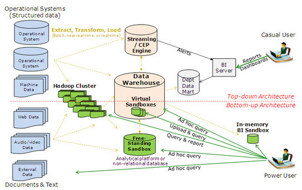

##

</img>

##

</img>

##

</img>

##

</img>

##

   
In many analyses, some of those  arrows will be connected to R.

##

   
Moving data around data centers is less of a serious problem than you'd think.

http://www.eecs.berkeley.edu/~ganesha/disk-irrelevant_hotos2011.pdf
 
Cache/fast storage coherency is usually more important.

##

   
Marshaling those data in and out of data format X or Y is!

http://blog.cloudera.com/blog/2016/03/feather-a-fast-on-disk-format-for-data-frames-for-r-and-python-powered-by-apache-arrow/

##

Yuck!

</img>

##

   
Feather: a common data frame serialization format for R and Python and ...

https://github.com/wesm/feather

##

   
High compute/data ratios benefit from elasticity

- For instance, SVD compute cost/storage ratio grows linearly with storage
- Some other algorithms might be more expensive
- But! Elastic compute may not be local to data; reducing friction to data is important

##

   
Feathercache: a fast object store interface for R (experimental)

- https://github.com/bwlewis/lz4
- https://github.com/bwlewis/feathercache

##
</img>

##
</img>

##
</img>

##

   
doRedis update due to CRAN soon, for now use GitHub

https://github.com/bwlewis/doRedis

Vignettes

- https://github.com/bwlewis/doRedis/blob/master/vignettes/doRedis.pdf
- https://github.com/bwlewis/doRedis/blob/master/vignettes/Amazon.pdf
- https://github.com/bwlewis/doRedis/blob/master/vignettes/Debug.pdf
