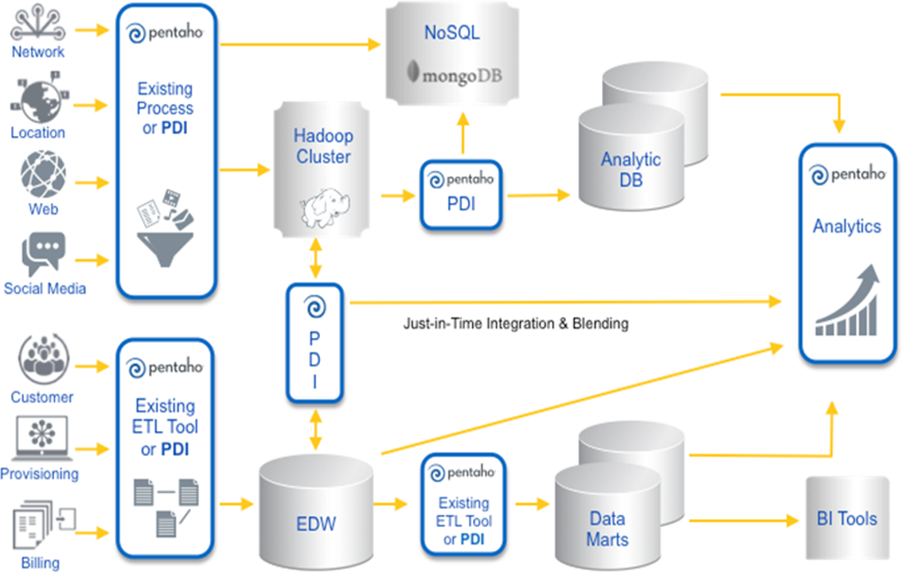
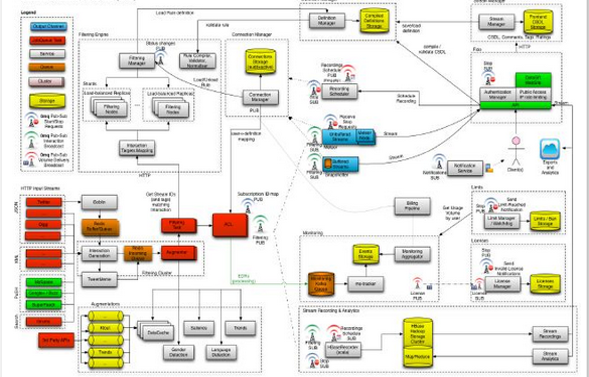
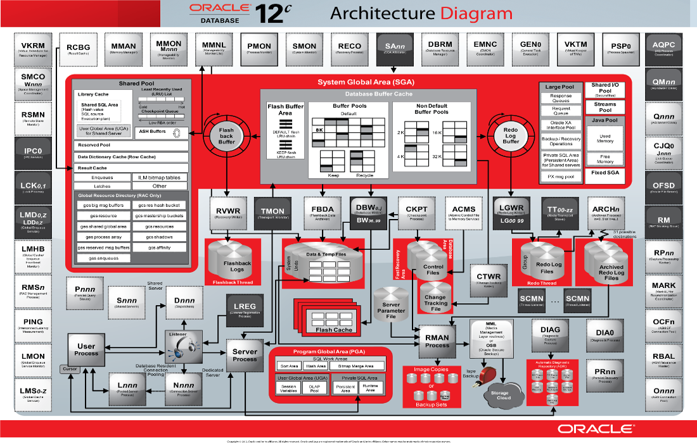
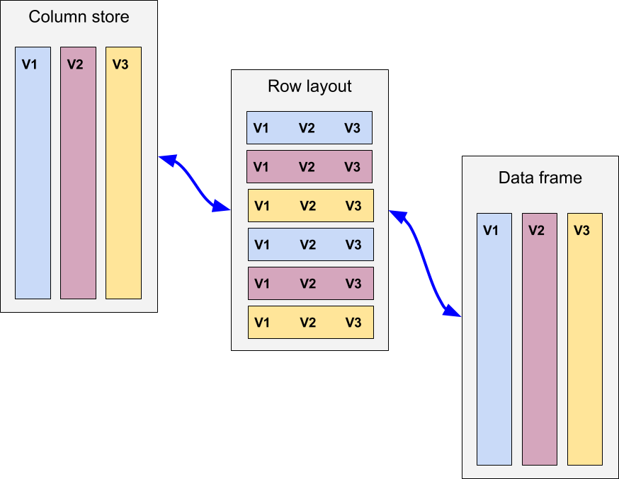
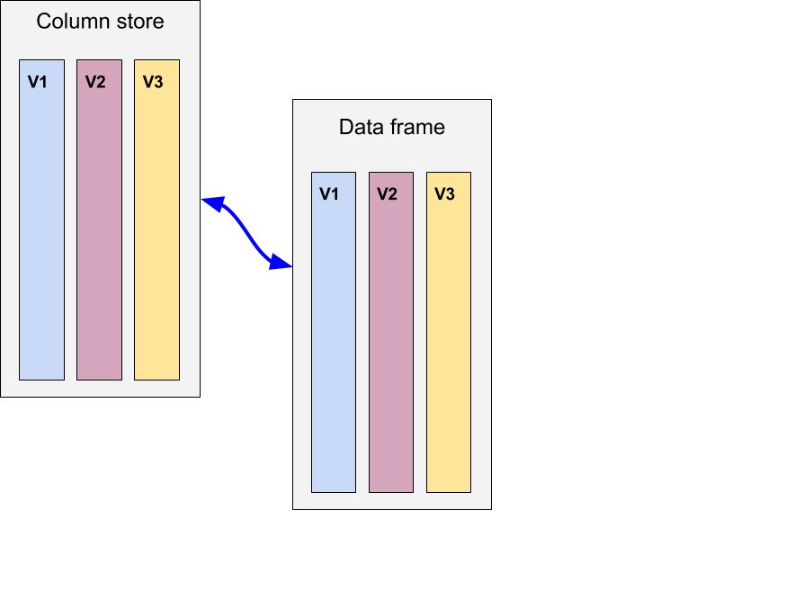
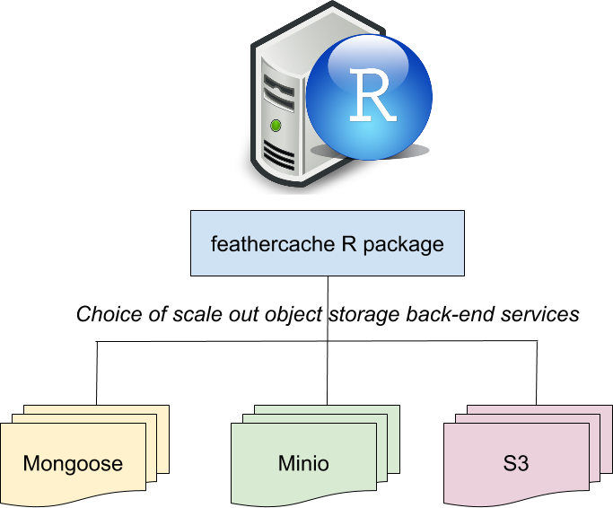
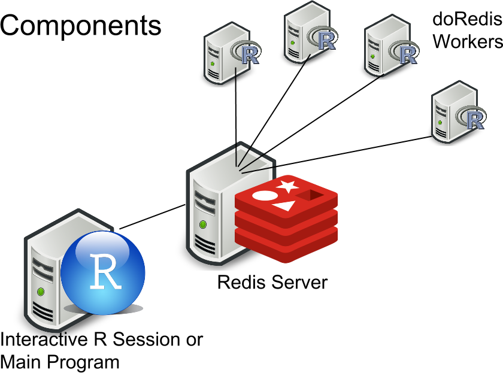

##

  
PDQ ATS research system

- Users new to R
- TAQ data assembled into partial books
- Running in Amazon EC2
- Research focused on transaction costs

##

   
Support diverse exploratory research programs

##

   
Running across all tickers from days to months or so

##

   
Lightweight software footprint, easy to use

##

  
You know how this starts

- Some data, maybe a lot of data
- Maybe a database
- Complicated modeling and research; need R or Python to be productive
- Then, maybe throw even more analysis tools into the mix
- You find yourself adding more computing horsepower
- Before you know it, you end up with...

##

</img>

##

</img>

##

</img>

##

</img>

##

   
Eventually, some of those arrows connect to R

##

   
Moving data around data centers not as big of a deal as you might think

http://www.eecs.berkeley.edu/~ganesha/disk-irrelevant_hotos2011.pdf
  
Cache/fast storage reuse is usually more important.

##

   
Marshaling those data in and out of various data formats is a big deal!

http://blog.cloudera.com/blog/2016/03/feather-a-fast-on-disk-format-for-data-frames-for-r-and-python-powered-by-apache-arrow/

##

Yuck!

</img>

##

   
Feather: a common data frame serialization format for R and Python and ...

https://github.com/wesm/feather

##

 
SciDB streaming API
 

</img>
</img>

##

   
Databases a great at managing mutable data
  
Append-only data are much simpler to work with

##

   
Feathercache: a fast object store interface for R (experimental)

Simple GET/PUT/DELETE-like interface

- https://github.com/bwlewis/lz4
- https://github.com/bwlewis/feathercache

##
</img>

##

  
Elastic computing with R and Redis on Amazon EC2

</img>

##
</img>

##

  
doRedis update due to CRAN soon, for now use GitHub

https://github.com/bwlewis/doRedis

Vignettes

- https://github.com/bwlewis/doRedis/blob/master/vignettes/doRedis.pdf
- https://github.com/bwlewis/doRedis/blob/master/vignettes/Amazon.pdf
- https://github.com/bwlewis/doRedis/blob/master/vignettes/Debug.pdf

##

  
Amazon EC2 Recipe

1. Instantiate a Linux image
2. Install R and desired packages, including doRedis
3. Run the doRedis service installer script
4. Make an AMI from this instance
5. Re-launch from AMI as needed, supplying config as EC2 user data
